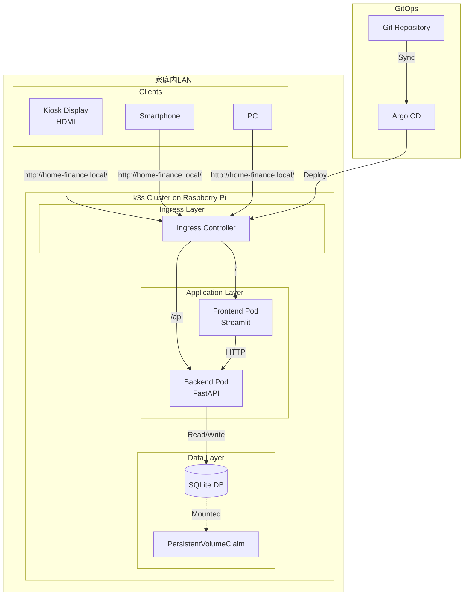
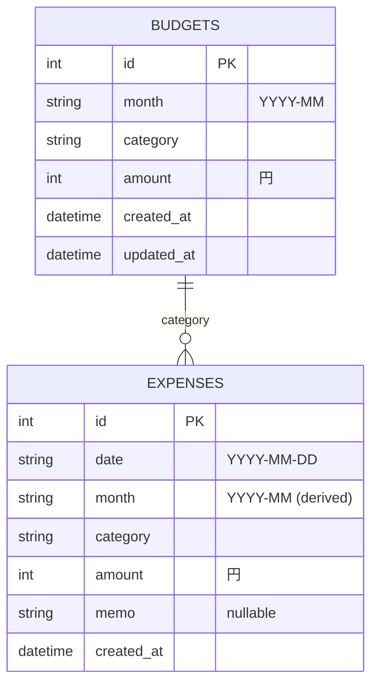

# 設計書

## 概要

家庭内向け生活費可視化システムは、Raspberry Pi上のk3sクラスターで動作するマイクロサービスアーキテクチャのアプリケーションです。システムは以下の3つの主要コンポーネントで構成されます：

1. **Backend API** (FastAPI) - ビジネスロジックとデータ管理
2. **Frontend UI** (Streamlit) - ダッシュボードと入力フォーム
3. **Database** (SQLite) - データ永続化層

システムは家庭内LANで完結し、GitOpsによる自動デプロイを実現します。

## アーキテクチャ

### システム構成図



### デプロイメント構成

- **Backend Deployment**: 1 replica (将来的にスケール可能)
- **Frontend Deployment**: 1 replica (将来的にスケール可能)
- **PVC**: ReadWriteOnce (RWO) - SQLiteは単一Writerのため
- **Services**: ClusterIP for internal communication
- **Ingress**: パスベースルーティング (`/` → Frontend, `/api` → Backend)

### 技術スタック

| レイヤー | 技術 | 理由 |
|---------|------|------|
| Backend | Python 3.11+ / FastAPI | 高速、型安全、非同期対応 |
| Frontend | Python 3.11+ / Streamlit | 迅速なUI開発、自動更新機能 |
| Database | SQLite 3 | 軽量、ファイルベース、k8s PVC対応 |
| ORM/DB Access | SQLAlchemy | DB抽象化、PostgreSQL移行容易 |
| Container | Docker | 標準的なコンテナ化 |
| Orchestration | k3s (Kubernetes) | 軽量、Raspberry Pi対応 |
| Package Manager | Helm 3 | 宣言的デプロイ、バージョン管理 |
| GitOps | Argo CD | 自動デプロイ、Git同期 |
| Ingress | Traefik (k3s default) | k3sデフォルト、設定簡単 |

## コンポーネントとインターフェース

### 1. Backend API (FastAPI)

#### ディレクトリ構造

```
backend/
├── app/
│   ├── __init__.py
│   ├── main.py              # FastAPIアプリケーションエントリーポイント
│   ├── config.py            # 設定管理
│   ├── database.py          # データベース接続管理
│   ├── models/
│   │   ├── __init__.py
│   │   ├── budget.py        # Budgetモデル
│   │   └── expense.py       # Expenseモデル
│   ├── schemas/
│   │   ├── __init__.py
│   │   ├── budget.py        # Budget Pydanticスキーマ
│   │   ├── expense.py       # Expense Pydanticスキーマ
│   │   └── summary.py       # Summary Pydanticスキーマ
│   ├── repositories/
│   │   ├── __init__.py
│   │   ├── base.py          # 基底リポジトリ
│   │   ├── budget.py        # Budgetリポジトリ
│   │   └── expense.py       # Expenseリポジトリ
│   ├── services/
│   │   ├── __init__.py
│   │   ├── budget.py        # 予算ビジネスロジック
│   │   ├── expense.py       # 支出ビジネスロジック
│   │   └── summary.py       # 集計ビジネスロジック
│   └── routers/
│       ├── __init__.py
│       ├── health.py        # ヘルスチェック
│       ├── budgets.py       # 予算API
│       ├── expenses.py      # 支出API
│       └── summary.py       # 集計API
├── tests/
│   └── ...
├── Dockerfile
├── requirements.txt
└── README.md
```

#### API エンドポイント

| Method | Path | 説明 | Request Body | Response |
|--------|------|------|--------------|----------|
| GET | `/health` | ヘルスチェック | - | `{"status": "ok"}` |
| POST | `/api/budgets` | 予算登録・更新 | `BudgetCreate` | `Budget` |
| GET | `/api/budgets` | 予算一覧取得 | Query: `month` | `List[Budget]` |
| GET | `/api/budgets/{id}` | 予算詳細取得 | - | `Budget` |
| DELETE | `/api/budgets/{id}` | 予算削除 | - | `{"message": "deleted"}` |
| POST | `/api/expenses` | 支出登録 | `ExpenseCreate` | `Expense` |
| GET | `/api/expenses` | 支出一覧取得 | Query: `month`, `category` | `List[Expense]` |
| GET | `/api/expenses/{id}` | 支出詳細取得 | - | `Expense` |
| DELETE | `/api/expenses/{id}` | 支出削除 | - | `{"message": "deleted"}` |
| GET | `/api/summary` | 月次集計取得 | Query: `month` (default: 今月) | `Summary` |

#### レイヤー責務

- **Routers**: HTTPリクエスト/レスポンス処理、バリデーション
- **Services**: ビジネスロジック、集計計算、日付処理
- **Repositories**: データアクセス、CRUD操作
- **Models**: SQLAlchemyモデル定義
- **Schemas**: Pydanticスキーマ、入出力バリデーション

### 2. Frontend UI (Streamlit)

#### ディレクトリ構造

```
frontend/
├── app/
│   ├── __init__.py
│   ├── main.py              # Streamlitアプリケーションエントリーポイント
│   ├── config.py            # 設定管理
│   ├── api_client.py        # Backend API クライアント
│   ├── pages/
│   │   ├── __init__.py
│   │   ├── dashboard.py     # ダッシュボード表示
│   │   ├── add_expense.py   # 支出追加フォーム
│   │   └── manage_budget.py # 予算管理フォーム
│   ├── components/
│   │   ├── __init__.py
│   │   ├── status_card.py   # 状態表示カード
│   │   ├── summary_card.py  # 集計表示カード
│   │   └── forms.py         # 共通フォームコンポーネント
│   └── utils/
│       ├── __init__.py
│       ├── formatting.py    # 数値・日付フォーマット
│       └── validation.py    # クライアント側バリデーション
├── tests/
│   └── ...
├── Dockerfile
├── requirements.txt
└── README.md
```

#### ページ構成

1. **ダッシュボード** (`/`)
   - 予算合計、使用合計、残額を大きく表示
   - 残日数、1日あたり残予算を表示
   - 使用率と状態（OK/WARN/DANGER）を色分け表示
   - 30秒ごとに自動更新（`st.rerun()`）
   - Kioskモード対応（フルスクリーン、大きいフォント）

2. **支出追加** (`/add_expense`)
   - カテゴリ選択（ドロップダウン）
   - 金額入力（数値）
   - 日付選択（デフォルト: 今日）
   - メモ入力（任意、テキストエリア）
   - 送信ボタン

3. **予算管理** (`/manage_budget`)
   - 月選択（YYYY-MM形式）
   - カテゴリ別予算入力フォーム
   - 既存予算の表示と編集
   - 送信ボタン

### 3. Database Schema

#### ERD



#### テーブル定義

**budgets**

| カラム | 型 | 制約 | 説明 |
|--------|---|------|------|
| id | INTEGER | PRIMARY KEY, AUTOINCREMENT | ID |
| month | VARCHAR(7) | NOT NULL | 月 (YYYY-MM) |
| category | VARCHAR(50) | NOT NULL | カテゴリ |
| amount | INTEGER | NOT NULL, CHECK(amount >= 0) | 予算額（円） |
| created_at | TIMESTAMP | NOT NULL, DEFAULT CURRENT_TIMESTAMP | 作成日時 |
| updated_at | TIMESTAMP | NOT NULL, DEFAULT CURRENT_TIMESTAMP | 更新日時 |

- UNIQUE制約: (month, category)
- INDEX: month, category

**expenses**

| カラム | 型 | 制約 | 説明 |
|--------|---|------|------|
| id | INTEGER | PRIMARY KEY, AUTOINCREMENT | ID |
| date | DATE | NOT NULL | 支出日 (YYYY-MM-DD) |
| month | VARCHAR(7) | NOT NULL | 月 (YYYY-MM, derived) |
| category | VARCHAR(50) | NOT NULL | カテゴリ |
| amount | INTEGER | NOT NULL, CHECK(amount >= 0) | 支出額（円） |
| memo | TEXT | NULL | メモ |
| created_at | TIMESTAMP | NOT NULL, DEFAULT CURRENT_TIMESTAMP | 作成日時 |

- INDEX: month, category, date

#### 初期カテゴリ

MVPでは以下の固定カテゴリを使用（将来的に編集可能にする）：

- 食費
- 日用品
- 交通費
- 娯楽
- 医療費
- その他

## データモデル

### Pydantic Schemas

#### BudgetCreate

```python
class BudgetCreate(BaseModel):
    month: str  # YYYY-MM format
    category: str
    amount: int  # >= 0
    
    @validator('month')
    def validate_month(cls, v):
        # YYYY-MM形式チェック
        ...
    
    @validator('amount')
    def validate_amount(cls, v):
        if v < 0:
            raise ValueError('amount must be >= 0')
        return v
```

#### Budget

```python
class Budget(BaseModel):
    id: int
    month: str
    category: str
    amount: int
    created_at: datetime
    updated_at: datetime
    
    class Config:
        orm_mode = True
```

#### ExpenseCreate

```python
class ExpenseCreate(BaseModel):
    date: date  # YYYY-MM-DD
    category: str
    amount: int  # >= 0
    memo: Optional[str] = None
    
    @validator('amount')
    def validate_amount(cls, v):
        if v < 0:
            raise ValueError('amount must be >= 0')
        return v
```

#### Expense

```python
class Expense(BaseModel):
    id: int
    date: date
    month: str  # derived from date
    category: str
    amount: int
    memo: Optional[str]
    created_at: datetime
    
    class Config:
        orm_mode = True
```

#### Summary

```python
class Summary(BaseModel):
    month: str
    total_budget: int
    total_spent: int
    remaining: int
    remaining_days: int
    per_day_budget: Optional[float]  # None if remaining_days == 0
    usage_rate: float  # 0-100+
    status: str  # "OK", "WARN", "DANGER"
    status_message: str
    status_color: str  # "green", "yellow", "red"
```

### ビジネスロジック

#### 集計計算 (SummaryService)

```python
def calculate_summary(month: str, tz: str = "Asia/Tokyo") -> Summary:
    """
    指定月の集計を計算
    
    Args:
        month: YYYY-MM形式の月
        tz: タイムゾーン
    
    Returns:
        Summary: 集計結果
    """
    # 1. 予算合計を取得
    total_budget = sum(budget.amount for budget in budgets)
    
    # 2. 支出合計を取得
    total_spent = sum(expense.amount for expense in expenses)
    
    # 3. 残額を計算
    remaining = total_budget - total_spent
    
    # 4. 残日数を計算（Asia/Tokyo）
    today = datetime.now(pytz.timezone(tz)).date()
    last_day = get_last_day_of_month(month)
    remaining_days = (last_day - today).days + 1
    if remaining_days < 0:
        remaining_days = 0
    
    # 5. 1日あたり残予算を計算
    per_day_budget = remaining / remaining_days if remaining_days > 0 else None
    
    # 6. 使用率を計算
    usage_rate = (total_spent / total_budget * 100) if total_budget > 0 else 0
    
    # 7. 状態を判定
    if usage_rate < 70:
        status = "OK"
        status_message = "予算内で順調です"
        status_color = "green"
    elif usage_rate < 90:
        status = "WARN"
        status_message = "予算の70%を超えました。注意してください"
        status_color = "yellow"
    else:
        status = "DANGER"
        status_message = "予算の90%を超えました！支出を抑えてください"
        status_color = "red"
    
    return Summary(...)
```

## エラーハンドリング

### Backend API

#### HTTPエラーレスポンス

```python
class ErrorResponse(BaseModel):
    detail: str
    error_code: Optional[str] = None
```

#### エラーコード

| HTTPステータス | エラーコード | 説明 |
|---------------|-------------|------|
| 400 | VALIDATION_ERROR | バリデーションエラー |
| 404 | NOT_FOUND | リソースが見つからない |
| 409 | CONFLICT | 重複エラー（予算の月・カテゴリ重複） |
| 500 | INTERNAL_ERROR | サーバー内部エラー |

#### 例外ハンドリング

```python
@app.exception_handler(ValidationError)
async def validation_exception_handler(request, exc):
    return JSONResponse(
        status_code=400,
        content={"detail": str(exc), "error_code": "VALIDATION_ERROR"}
    )

@app.exception_handler(Exception)
async def general_exception_handler(request, exc):
    logger.error(f"Unhandled exception: {exc}", exc_info=True)
    return JSONResponse(
        status_code=500,
        content={"detail": "Internal server error", "error_code": "INTERNAL_ERROR"}
    )
```

### Frontend UI

- API呼び出し失敗時: `st.error()` でエラーメッセージ表示
- バリデーションエラー: フォーム送信前にクライアント側でチェック
- ネットワークエラー: リトライ機能（最大3回）

## テスト戦略

### Backend API

#### 単体テスト

- **Repositories**: モックDBを使用したCRUD操作テスト
- **Services**: ビジネスロジックのテスト（集計計算、日付処理）
- **Routers**: FastAPI TestClientを使用したエンドポイントテスト

#### テストツール

- pytest
- pytest-asyncio
- httpx (TestClient)
- SQLite in-memory database

#### テストカバレッジ目標

- Services: 80%以上
- Repositories: 70%以上
- Routers: 70%以上

### Frontend UI

#### 手動テスト

- ダッシュボード表示確認
- フォーム入力・送信確認
- レスポンシブデザイン確認（スマホ、PC、Kiosk）
- 自動更新動作確認

#### E2Eテスト（将来）

- Selenium/Playwright を使用した自動テスト

### 統合テスト

- Docker Composeを使用したローカル環境での統合テスト
- Backend + Frontend + SQLite の連携確認

## k8s デプロイメント設計

### Helm Chart 構造

```
helm/
├── Chart.yaml
├── values.yaml
├── values-dev.yaml
├── values-prod.yaml
└── templates/
    ├── _helpers.tpl
    ├── namespace.yaml
    ├── pvc.yaml
    ├── backend-deployment.yaml
    ├── backend-service.yaml
    ├── frontend-deployment.yaml
    ├── frontend-service.yaml
    └── ingress.yaml
```

### リソース定義

#### Backend Deployment

```yaml
apiVersion: apps/v1
kind: Deployment
metadata:
  name: home-finance-backend
spec:
  replicas: 1
  selector:
    matchLabels:
      app: home-finance-backend
  template:
    metadata:
      labels:
        app: home-finance-backend
    spec:
      containers:
      - name: backend
        image: home-finance-backend:latest
        ports:
        - containerPort: 8000
        env:
        - name: DATABASE_URL
          value: "sqlite:////data/home_finance.db"
        - name: TZ
          value: "Asia/Tokyo"
        volumeMounts:
        - name: data
          mountPath: /data
        livenessProbe:
          httpGet:
            path: /health
            port: 8000
          initialDelaySeconds: 10
          periodSeconds: 30
        readinessProbe:
          httpGet:
            path: /health
            port: 8000
          initialDelaySeconds: 5
          periodSeconds: 10
        resources:
          requests:
            memory: "128Mi"
            cpu: "100m"
          limits:
            memory: "256Mi"
            cpu: "500m"
      volumes:
      - name: data
        persistentVolumeClaim:
          claimName: home-finance-data
```

#### Frontend Deployment

```yaml
apiVersion: apps/v1
kind: Deployment
metadata:
  name: home-finance-frontend
spec:
  replicas: 1
  selector:
    matchLabels:
      app: home-finance-frontend
  template:
    metadata:
      labels:
        app: home-finance-frontend
    spec:
      containers:
      - name: frontend
        image: home-finance-frontend:latest
        ports:
        - containerPort: 8501
        env:
        - name: BACKEND_URL
          value: "http://home-finance-backend:8000"
        - name: TZ
          value: "Asia/Tokyo"
        livenessProbe:
          httpGet:
            path: /_stcore/health
            port: 8501
          initialDelaySeconds: 10
          periodSeconds: 30
        readinessProbe:
          httpGet:
            path: /_stcore/health
            port: 8501
          initialDelaySeconds: 5
          periodSeconds: 10
        resources:
          requests:
            memory: "256Mi"
            cpu: "100m"
          limits:
            memory: "512Mi"
            cpu: "500m"
```

#### PersistentVolumeClaim

```yaml
apiVersion: v1
kind: PersistentVolumeClaim
metadata:
  name: home-finance-data
spec:
  accessModes:
  - ReadWriteOnce
  resources:
    requests:
      storage: 1Gi
  storageClassName: local-path  # k3s default
```

#### Ingress

```yaml
apiVersion: networking.k8s.io/v1
kind: Ingress
metadata:
  name: home-finance-ingress
  annotations:
    kubernetes.io/ingress.class: traefik
spec:
  rules:
  - host: home-finance.local
    http:
      paths:
      - path: /api
        pathType: Prefix
        backend:
          service:
            name: home-finance-backend
            port:
              number: 8000
      - path: /
        pathType: Prefix
        backend:
          service:
            name: home-finance-frontend
            port:
              number: 8501
```

### Argo CD Application

```yaml
apiVersion: argoproj.io/v1alpha1
kind: Application
metadata:
  name: home-finance
  namespace: argocd
spec:
  project: default
  source:
    repoURL: https://github.com/[user]/home-finance.git
    targetRevision: main
    path: helm
    helm:
      valueFiles:
      - values.yaml
  destination:
    server: https://kubernetes.default.svc
    namespace: home-finance
  syncPolicy:
    automated:
      prune: true
      selfHeal: true
    syncOptions:
    - CreateNamespace=true
```

## 設定管理

### Backend 環境変数

| 変数名 | 説明 | デフォルト値 |
|--------|------|-------------|
| DATABASE_URL | データベース接続URL | `sqlite:////data/home_finance.db` |
| TZ | タイムゾーン | `Asia/Tokyo` |
| LOG_LEVEL | ログレベル | `INFO` |
| CORS_ORIGINS | CORS許可オリジン | `["*"]` |

### Frontend 環境変数

| 変数名 | 説明 | デフォルト値 |
|--------|------|-------------|
| BACKEND_URL | Backend API URL | `http://home-finance-backend:8000` |
| TZ | タイムゾーン | `Asia/Tokyo` |
| AUTO_REFRESH_INTERVAL | 自動更新間隔（秒） | `30` |
| KIOSK_MODE | Kioskモード有効化 | `false` |

## ログ設計

### ログフォーマット

```json
{
  "timestamp": "2025-12-25T10:30:00+09:00",
  "level": "INFO",
  "logger": "app.services.summary",
  "message": "Summary calculated",
  "context": {
    "month": "2025-12",
    "total_budget": 300000,
    "total_spent": 150000,
    "usage_rate": 50.0
  }
}
```

### ログレベル

- **DEBUG**: 開発時の詳細情報
- **INFO**: 通常の操作ログ（API呼び出し、集計計算）
- **WARNING**: 警告（予算超過、バリデーションエラー）
- **ERROR**: エラー（DB接続失敗、API呼び出し失敗）
- **CRITICAL**: 致命的エラー（システム起動失敗）

## セキュリティ設計

### 現在の実装（MVP）

- 家庭内LAN完結（インターネット非公開）
- 認証なし（家庭内信頼ネットワーク前提）
- HTTPS不要（LAN内通信）

### 将来の拡張

- Basic認証またはOAuth2.0
- k8s Secretによる認証情報管理
- HTTPS対応（Let's Encrypt）
- RBAC（Role-Based Access Control）

## パフォーマンス設計

### 目標

- ダッシュボード表示: < 1秒
- API レスポンス: < 500ms
- 自動更新: 30秒間隔（設定可能）

### 最適化戦略

- SQLiteインデックス活用
- 集計結果のキャッシュ（将来）
- 非同期処理（FastAPI）
- コネクションプーリング

## 移行戦略（SQLite → PostgreSQL）

### 設計原則

- Repository パターンによる抽象化
- SQLAlchemy ORM 使用
- 環境変数による DB 切り替え

### 移行手順（将来）

1. PostgreSQL Deployment 追加
2. DATABASE_URL 環境変数変更
3. データマイグレーションスクリプト実行
4. 動作確認後、SQLite PVC 削除

## モニタリング設計（将来）

### メトリクス

- API レスポンスタイム
- エラー率
- DB クエリ実行時間
- Pod リソース使用率

### ツール候補

- Prometheus + Grafana
- Loki (ログ集約)
- k8s Dashboard

## 災害復旧設計

### バックアップ

- PVC スナップショット（k8s）
- SQLite ファイルの定期バックアップ（CronJob）
- Git リポジトリによる設定バックアップ

### リストア

1. PVC スナップショットからリストア
2. または、バックアップファイルを新規 PVC にコピー
3. Helm でアプリケーション再デプロイ

## 開発環境

### ローカル開発

```bash
# Backend
cd backend
python -m venv venv
source venv/bin/activate
pip install -r requirements.txt
uvicorn app.main:app --reload

# Frontend
cd frontend
python -m venv venv
source venv/bin/activate
pip install -r requirements.txt
streamlit run app/main.py
```

### Docker Compose

```yaml
version: '3.8'
services:
  backend:
    build: ./backend
    ports:
      - "8000:8000"
    volumes:
      - ./data:/data
    environment:
      - DATABASE_URL=sqlite:////data/home_finance.db
      - TZ=Asia/Tokyo
  
  frontend:
    build: ./frontend
    ports:
      - "8501:8501"
    environment:
      - BACKEND_URL=http://backend:8000
      - TZ=Asia/Tokyo
    depends_on:
      - backend
```

## まとめ

この設計書は、家庭内向け生活費可視化システムのMVP実装のための詳細な技術設計を提供します。主要な設計原則は以下の通りです：

1. **シンプルさ**: MVPに必要な機能のみを実装
2. **拡張性**: 将来の機能追加を考慮した設計
3. **運用性**: k8s上での安定運用を重視
4. **保守性**: レイヤー分離、テスト可能な設計

次のステップは、この設計に基づいた実装タスクリストの作成です。
